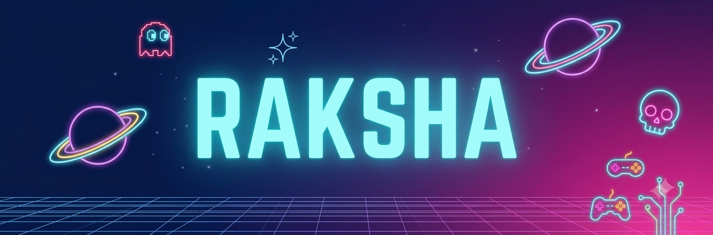

  <!-- HERO BANNER -->
  

    

  <!-- TYPING HEADING EFFECT -->
  <h1>
    
  </h1>

  

    <b>Computer Science & Engineering student (AI & ML) building full-stack web applications and LLM-powered solutions.</b>
  

  <!-- QUICK ACTION BUTTONS & BADGES -->
  

    
    &nbsp;
    
    &nbsp;
    
    &nbsp;
    
  

  

 

<!-- ABOUT ME SECTION -->
<table>
  <tr>
    <td width="60%" valign="top">
      <h2>⚡ About Me</h2>
      

        I am a <b>Computer Science and Engineering student specializing in AI & ML</b> at A J Institute of Engineering and Technology, Mangaluru.
      

      <ul>
        <li>🎓 <b>Education:</b> B.E. in CSE (AI & ML) | Expected 2028 (CGPA: 9.33)</li>
        <li>🔭 <b>Currently focused on:</b> Full-stack web development, RESTful APIs, and LLM integrations</li>
        <li>💬 <b>Ask me about:</b> React, Node.js, Supabase, Groq API (Llama 3.3), & DBMS</li>
      </ul>
    </td>
    <td width="40%" align="center" valign="middle">
      
    </td>
  </tr>
</table>

 

<!-- TECH STACK SECTION -->
<h2 align="center">💻 Tech Stack & Skills</h2>

  

  

    <b>Languages:</b> Python · Java · JavaScript · TypeScript · SQL · HTML/CSS  
    <b>Frontend & UI:</b> React.js · Tailwind CSS · Vite · shadcn/ui · React Hook Form · Zod · TanStack Query · Recharts  
    <b>Backend & DB:</b> Node.js · Express.js · FastAPI · PostgreSQL · Supabase (Auth, Storage, Edge Functions)  
    <b>AI & LLM:</b> Groq API (Llama 3.3) · Prompt Engineering
  

 

<!-- FEATURED PROJECTS -->
<h2>🚀 Featured Projects</h2>

<table>
  <thead>
    <tr>
      <th>Project Name</th>
      <th>Description</th>
      <th>Tech Stack</th>
    </tr>
  </thead>
  <tbody>
    <tr>
      <td><b>📍 CampusFind</b> <small>College Lost & Found Hub</small></td>
      <td>Full-stack lost-and-found platform with Supabase RLS, admin dashboard, realtime notifications, Edge Functions, and automated email alerts.</td>
      <td><code>React</code> <code>TypeScript</code> <code>Tailwind</code> <code>Supabase</code> <code>PostgreSQL</code></td>
    </tr>
    <tr>
      <td><b>🏥 MediTrack AI</b> <small>Smart Health Records Manager</small></td>
      <td>Full-stack health manager with 16 CRUD REST endpoints. Integrates Groq's Llama 3.3 model for health summaries and Recharts for trend charts.</td>
      <td><code>React.js</code> <code>Node.js</code> <code>Express.js</code> <code>PostgreSQL</code> <code>Groq API</code></td>
    </tr>
    <tr>
      <td><b>📅 DocLink</b> <small>Appointment Management Dashboard</small></td>
      <td>Admin dashboard for scheduling appointments, doctor/patient management, React Query data handling, and analytics view using Recharts.</td>
      <td><code>React</code> <code>TypeScript</code> <code>Tailwind</code> <code>shadcn/ui</code> <code>Recharts</code></td>
    </tr>
  </tbody>
</table>

 

<!-- GITHUB ANALYTICS -->
<h2 align="center">📊 GitHub Analytics</h2>

  
  

 

  

 

<!-- CONTACT & VISITOR COUNTER -->
<h2 align="center">🤝 Connect With Me</h2>

  Feel free to reach out for collaborations or opportunities!

  
  &nbsp;
  

 

  
  
<small>Profile Views</small>

  
   

  

